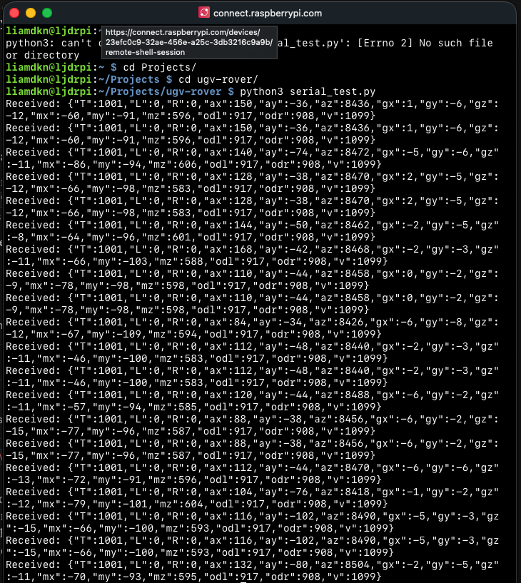
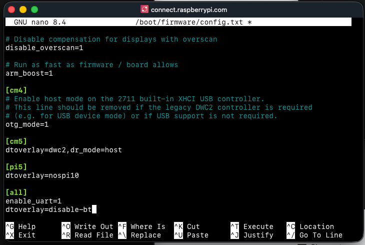
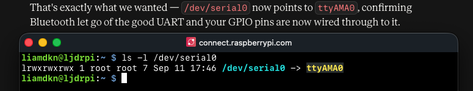

# Devlog

Build log for [Robot Name] — a six-wheel tank-tracked UGV built on a
Waveshare UGV Rover chassis, running a Raspberry Pi 4B + ESP32 driver
board. Entries are dated, roughly chronological, and unfiltered —
including the stuff that didn't work.

---

## Entry template (copy this for each new entry)

## YYYY-MM-DD — Short, descriptive title

**Goal for this session:**
...
**What I did:**
...
**What broke / went wrong:**
...
**What I learned:**
...
**Next:**
...

---

---Domnt commit this part:
Notes to catch up on.
Line 51 

## 11/09/26 — Delivery, Hardware mounting + first boot

**Goal for this session:**
Get familiar with the robot, try get pi chatting to the ROS onboard module. 

**What I did:**
Unboxed the robot, inserted 3x18650 batteries, mounted PI on ROS GPIO pins, attached PI camera and finished hardware assemble. 
Connected to UAG network, accessed web app on http://192.168.4.1 where rover control was successfully from Mac web app to ESP32 onboard controller. 
Got the robot moving from serial input!  
Claude my Lab partner and I worked together in the evening to get serical connection to the RPI working with the onboard controller. 

**What broke / went wrong:**
PI was struggling to mount due to the correct heights of standoff screws in the kit, the ones in the bag were so long that the GPIO
pins wouldn't reach? interesting. Using ones purchased separately I was able to mount the PI on onto the onboard microcontroller, Put 2x folds the camera ribbon cable
cause it would have had to twist so I just folded it and will hop that does not damage it. Had to use third party standoff screws to put the roof on the chassis too 
cause the ones in the pack were too short, isn't that so odd. Then again the fact it came with no instruction so is that really a surprise. 

Claude assisted me in writing a few lines of code to write a serial string out of the GPIO pins but there was no movement. We were sending the same
line that the webapp sends but to no avail until it was discovered from the waveshare wiki form that we were missing a crucial + b'\n') in our encode 
line: ser.write(command.encode() + b'\n')...dummies 
Took my first photo on the pi. very simply to verifiy the ribbon cable was the right direction (50% chance here). *insert photo here* 

**What I learned:**
Have to disable bluetooth on th epI as the BT is hogging the PIs ttyAMAO chip so diabling it will free up that for my serical commands.

How to SSH into a RPI terminal from codium on my mac, so handy instead of writing in a console and running from command line while running scripts from the comfort of my mac 

**Next:**
[you fill this in]